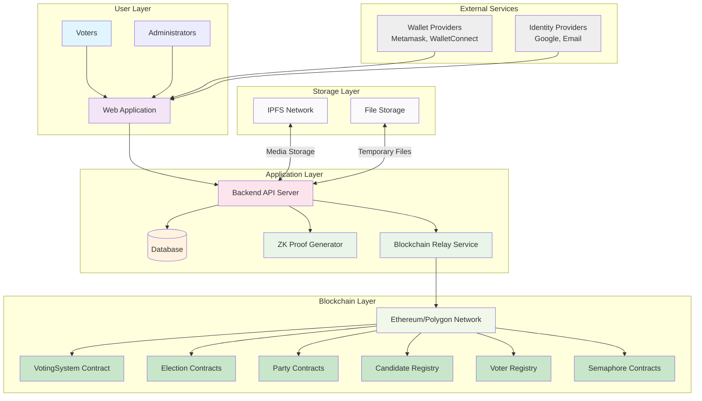

## Component Explanations

### 1. User Layer

#### Voters
Regular users who participate in elections by casting votes. They interact with the system through the web application using familiar authentication methods (email/password, social login).

#### Administrators
Election organizers who create and manage elections, parties, candidates, and voter registration. They have elevated privileges in the system.

### 2. Application Layer

#### Web Application
The frontend interface built with React and TypeScript, providing a familiar web experience to users. It communicates with the backend API server through HTTP requests.

#### Backend API Server
The core server application built with Hono, handling all business logic, authentication, and coordination between different system components. It exposes RESTful APIs for frontend consumption.

#### Database
A SQLite database (using Kysely ORM) that stores user accounts, session data, election metadata, and other application data that doesn't need to be on-chain.

#### ZK Proof Generator
Responsible for generating Zero-Knowledge proofs using Semaphore protocol. It creates proofs that voters are eligible without revealing their identity.

#### Blockchain Relay Service
Handles all blockchain interactions, submitting transactions and paying gas fees on behalf of users. This hides blockchain complexity from voters.

### 3. Blockchain Layer

#### Ethereum/Polygon Network
The underlying blockchain network where all voting transactions are recorded immutably. The system can be deployed on either Ethereum mainnet or Polygon for cost efficiency.

#### VotingSystem Contract
The central hub contract that manages the entire voting system. It acts as a factory for creating elections and parties, and maintains references to all registry contracts.

#### Election Contracts
Individual smart contracts representing each election. They handle the voting process, candidate registration, and vote tallying for specific elections.

#### Party Contracts
Smart contracts representing political parties. Each party contract manages its own candidates and party-specific information.

#### Candidate Registry
Central registry for all candidates across all elections and parties. Maintains a global list of candidates and their information.

#### Voter Registry
Central registry for all voters. Manages voter eligibility and registration status across elections.

#### Semaphore Contracts
Specialized ZK contracts that enable anonymous signaling. They handle group management, identity verification, and proof verification for private voting.

### 4. Storage Layer

#### IPFS Network
Decentralized storage for election media (candidate photos, party logos, etc.). Content is addressed by CID (Content Identifier) for permanence.

#### File Storage
Temporary local file storage for processing uploads before they are committed to IPFS.

### 5. External Services

#### Wallet Providers
Optional integration with traditional web3 wallets (MetaMask, WalletConnect) for users who prefer wallet-based authentication.

#### Identity Providers
Integration with familiar authentication providers (Google, Email) to make the system accessible to non-web3 users.

## Data Flow

### Voter Registration Flow
1. Voter registers via web app with email/password
2. Backend creates voter record in database
3. Backend generates Semaphore identity for voter
4. Backend stores encrypted private key in database
5. Backend registers voter's public commitment on blockchain

### Election Creation Flow
1. Admin creates election via web app
2. Backend creates election record in database
3. Backend deploys election smart contract
4. Backend registers election with VotingSystem contract
5. Election details stored on IPFS

### Voting Flow (Gasless/ZK)
1. Voter logs in via web app
2. Voter selects candidates and submits ballot
3. Backend retrieves voter's encrypted private key
4. Backend generates ZK proof of voter eligibility
5. Backend submits vote transaction to blockchain (pays gas)
6. Blockchain verifies ZK proof and records vote
7. Vote confirmation sent to voter

### Results Flow
1. Anyone accesses results via web app
2. Backend queries blockchain for election results
3. Results displayed with ZK privacy guarantees
4. All votes are immutable on blockchain

## Security Model

### Privacy
- **ZK Proofs**: Voter eligibility proven without revealing identity
- **Semaphore**: Anonymous group membership verification
- **Nullifiers**: Prevent double voting without linking votes

### Integrity
- **Immutable Records**: All votes recorded on blockchain
- **Transparent Verification**: Anyone can verify results
- **Smart Contract Logic**: Deterministic vote processing

### Availability
- **Decentralized Storage**: IPFS for media resilience
- **Multiple Nodes**: Blockchain network redundancy
- **Traditional Hosting**: Web app hosted conventionally

## Scalability Considerations

### Horizontal Scaling
- **Database Sharding**: Separate databases per election
- **Load Balancing**: Multiple backend instances
- **CDN**: Content delivery for static assets

### Blockchain Optimization
- **Batch Operations**: Multiple votes in single transactions
- **Event Indexing**: Off-chain indexing for faster queries
- **Layer 2 Solutions**: Polygon for reduced costs

## Future Enhancements

### Advanced Features
- **Quadratic Voting**: With ZK privacy
- **Ranked Choice**: Complex voting mechanisms
- **Multi-Election Identity**: Single identity for multiple elections

### Improved UX
- **Mobile Integration**: Native mobile app
- **Social Recovery**: Recover identities via social connections
- **Progressive Disclosure**: Gradually reveal ZK complexity

### Enhanced Security
- **Multi-Signature**: Admin actions require multiple approvals
- **Threshold Cryptography**: Distributed key management
- **Quantum Resistance**: Post-quantum cryptographic algorithms