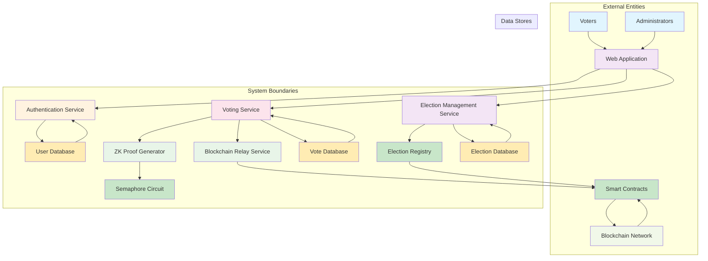
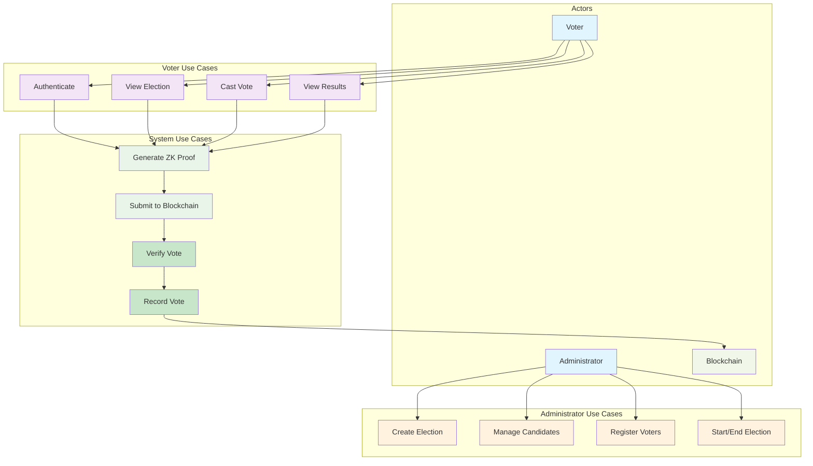
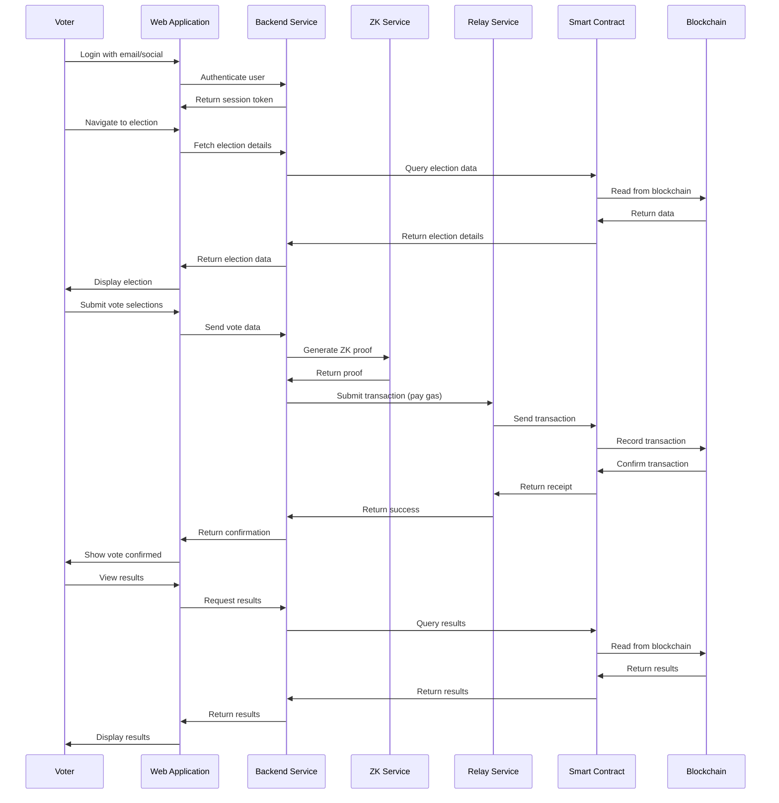
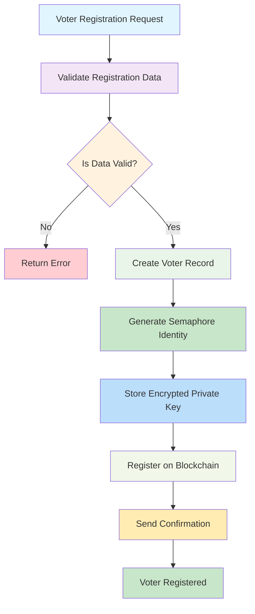
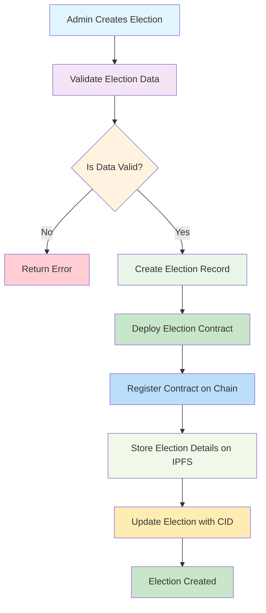
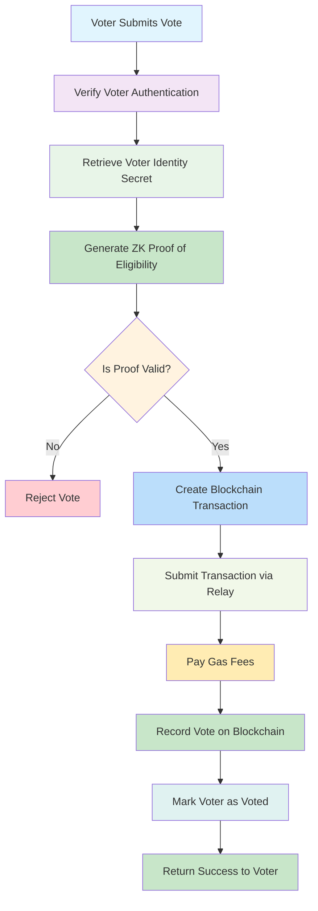

# System Workflow Diagrams

This document presents various workflow diagrams illustrating how the Blockchain Voting System operates with ZK privacy and gasless transactions.

## 1. Data Flow Diagram (DFD)

## 2. Use Case Diagram

## 3. Voting Process Sequence Diagram

## 4. Voter Registration Process Flow

## 5. Election Creation Process Flow

## 6. Vote Casting Process with ZK Privacy

## Diagram Explanations

### Data Flow Diagram (DFD)
This diagram shows the flow of data between external entities, system processes, and data stores. The key flows include:
- Voter interactions with the web application
- Authentication and session management
- Voting process with ZK proof generation
- Blockchain relay service for gasless transactions
- Data storage in various databases

### Use Case Diagram
This diagram illustrates the various functionalities available to different actors in the system:
- Voters can authenticate, view elections, cast votes, and view results
- Administrators can manage elections, candidates, and voters
- The system internally handles ZK proof generation, blockchain submission, and vote verification

### Voting Process Sequence Diagram
This diagram shows the step-by-step interaction between components during the voting process:
1. Voter authentication via email/social
2. Election viewing with ZK proof generation
3. Vote submission through backend relay
4. Blockchain recording with gas payment
5. Confirmation to voter without blockchain awareness

### Voter Registration Process Flow
This flowchart shows how voters are registered in the system:
1. Registration data validation
2. Semaphore identity generation for privacy
3. Encrypted private key storage
4. Blockchain registration for verification

### Election Creation Process Flow
This flowchart shows how administrators create elections:
1. Election data validation
2. Smart contract deployment
3. Blockchain registration
4. IPFS storage for election details

### Vote Casting Process with ZK Privacy
This flowchart shows how votes are cast with privacy protection:
1. Voter authentication verification
2. ZK proof generation for eligibility
3. Blockchain transaction creation and relay
4. Gas payment by backend
5. Vote recording with privacy guarantees

These diagrams provide a comprehensive view of how the system works with ZK privacy and gasless transactions while hiding blockchain complexity from users.