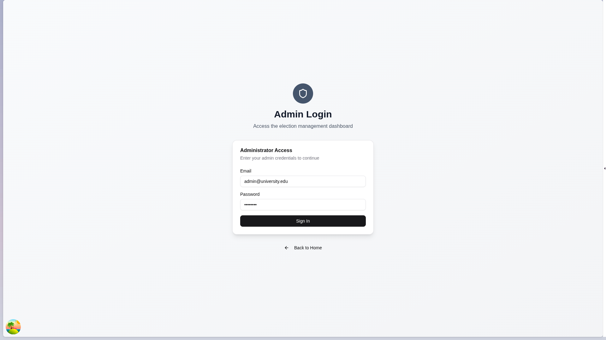

# Frontend Interface Design

This document showcases the user interface design for the Blockchain Voting System with ZK privacy and gasless transactions. The interface has been designed to provide a familiar web experience while leveraging blockchain technology behind the scenes.

## Landing Page

The landing page provides an overview of the voting system and directs users to the appropriate sections based on their role.

Key features:
- Clear navigation to voter and admin sections
- System overview and benefits
- Responsive design for all devices
- Modern, clean aesthetic

## Voter Experience

### Pre-Voting Authentication

Before voters can access the ballot, they must authenticate. In the blockchain version, this will be replaced with wallet connection:

Current implementation uses voter codes for authentication. In the blockchain version:
- Voters will connect their wallets instead of entering codes
- ZK proofs will verify eligibility without revealing identity
- Gasless transactions will eliminate blockchain complexity

### Candidate Selection

Once authenticated, voters can view and select candidates for each position:

Key features:
- Visual candidate cards with photos and information
- Intuitive selection mechanism with clear feedback
- Responsive layout for desktop and mobile devices
- Real-time validation of selections

### Vote Submitted

After submitting their votes, voters see a confirmation screen:

Key features:
- Clear confirmation of successful vote submission
- Blockchain transaction details (hidden in gasless version)
- Navigation options to view results or return home
- ZK privacy assurance messaging

### Election Results

Voters can view election results after voting:

Key features:
- Real-time vote counting visualization
- Candidate rankings with vote percentages
- Transparent display of blockchain-verified results
- ZK privacy protection indicators

## Administrator Experience

### Admin Login

Administrators access the system through a dedicated login portal:

Key features:
- Secure authentication with email/password
- Role-based access control
- Multi-factor authentication support (planned)
- Password recovery mechanisms

### Admin Dashboard

The main dashboard provides an overview of all elections and system metrics:

Key features:
- Election status at a glance
- Quick actions for common tasks
- System metrics and analytics
- Recent activity feed

### Create Election Form

Administrators can create new elections with detailed configuration:

Key features:
- Comprehensive election setup wizard
- Date and time selection with validation
- Position and candidate management
- Real-time form validation

## Technical Implementation

### Blockchain Integration

The frontend interface seamlessly integrates blockchain technology without exposing complexity to users:

#### Wallet Connection
- **Automatic Detection**: Detect popular wallets (MetaMask, WalletConnect)
- **Fallback Options**: Email/social login with backend key management
- **Seamless Experience**: Hide wallet prompts during voting

#### Gasless Transactions
- **Backend Relay**: System pays gas fees on behalf of users
- **Transparent Process**: Users never see gas prices or fees
- **Fast Execution**: Optimized transaction submission

#### ZK Privacy Indicators
- **Privacy Assurance**: Clear messaging about vote privacy
- **Verification Proof**: Evidence of ZK verification without technical details
- **Trust Building**: Transparency about privacy protections

### Responsive Design

The interface adapts to different device sizes:

#### Desktop
- Full-featured experience with advanced controls
- Multi-column layouts for complex data
- Keyboard navigation support

#### Tablet
- Condensed layouts with touch-friendly controls
- Adaptive navigation menus
- Optimized form layouts

#### Mobile
- Streamlined experience focused on core actions
- Touch-optimized controls and gestures
- Progressive disclosure of complex features

## User Experience Principles

### Simplicity
- Familiar web interface patterns
- Minimal blockchain terminology exposure
- Clear navigation and information hierarchy

### Accessibility
- WCAG 2.1 AA compliance
- Screen reader support
- Keyboard navigation
- Color contrast optimization

### Performance
- Fast loading times with lazy loading
- Efficient data fetching with caching
- Optimized images and assets
- Smooth animations and transitions

### Security
- Secure authentication mechanisms
- Encrypted data transmission
- Protection against common web vulnerabilities
- Privacy-focused design

## Future Enhancements

### Improved Mobile Experience
- Native mobile app with biometric authentication
- Offline capabilities for ballot review
- Push notifications for election updates

### Enhanced Visualizations
- Interactive charts and graphs for results
- Real-time vote tracking (with privacy protections)
- Comparison tools for candidate positions

### Social Features
- Shareable election summaries (privacy-preserving)
- Community discussion forums
- Election reminder notifications

This frontend interface design provides a balance between usability and blockchain benefits while maintaining the familiarity of traditional web applications.