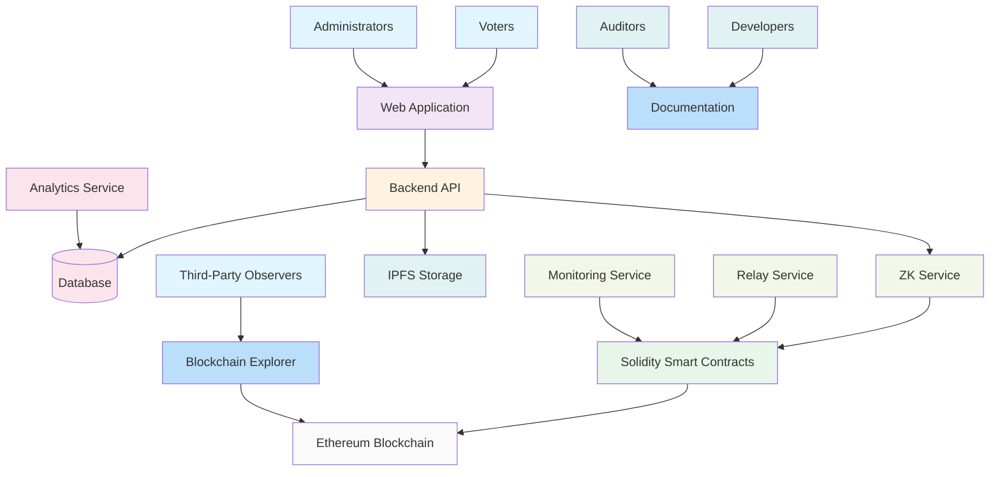

# System Architecture

This document provides a comprehensive overview of the Blockchain Voting System architecture, detailing how different components interact to provide a secure, transparent, and private voting solution.

## Overview

The Blockchain Voting System is a decentralized application built on Ethereum-compatible blockchain networks. It combines the transparency and immutability of blockchain technology with Zero-Knowledge (ZK) privacy to ensure voter anonymity while maintaining election integrity.

## Architecture Diagram

## Component Description

### 1. Voters and Administrators

**Voters** and **Administrators** are the primary users of the system:

- **Voters**: Eligible participants who cast votes in elections
- **Administrators**: Authorized users who manage elections, candidates, and voter registration

Both interact with the system through the **Web Application**, which provides a user-friendly interface without exposing blockchain complexity.

### 2. Web Application

The **Web Application** serves as the primary user interface:

- **Frontend Framework**: React with TypeScript
- **UI Library**: shadcn/ui components with Tailwind CSS
- **Routing**: TanStack Router for client-side navigation
- **State Management**: React Context and TanStack Query
- **Forms**: React Hook Form with Zod validation

Key features:
- Traditional web experience (no wallet installation required)
- Email/password authentication
- Responsive design for all devices
- Real-time updates through WebSocket connections

### 3. Backend API

The **Backend API** acts as the central coordinator:

- **Framework**: Hono.js for lightweight API development
- **Dependency Injection**: Custom DI container for modular architecture
- **Database ORM**: Kysely for type-safe database operations
- **Authentication**: JWT-based session management
- **Business Logic**: Election management, voter verification, and vote processing

Responsibilities:
- Handle user authentication and authorization
- Coordinate between frontend and blockchain
- Manage traditional database operations
- Generate and verify ZK proofs
- Relay transactions to blockchain

### 4. Database

The **Database** stores non-blockchain data:

- **Technology**: SQLite for development, PostgreSQL for production
- **Schema**: Voter profiles, election metadata, user accounts
- **ORM**: Kysely for type-safe database operations
- **Migrations**: Version-controlled schema changes

Data stored:
- User account information (administrators)
- Voter profile data (names, emails, photos)
- Election descriptions and metadata
- Session tokens and authentication data

### 5. ZK Service

The **ZK Service** provides Zero-Knowledge privacy:

- **Library**: Semaphore protocol for anonymous signaling
- **Proof Generation**: ZK-SNARK proofs for voter eligibility
- **Identity Management**: Semaphore identities for voters
- **Group Management**: Merkle trees for voter groups

Key features:
- Generate ZK proofs of voter eligibility
- Verify ZK proofs on-chain
- Prevent double voting through nullifiers
- Maintain voter anonymity

### 6. Solidity Smart Contracts

The **Solidity Smart Contracts** provide blockchain functionality:

- **Language**: Solidity ^0.8.24
- **Framework**: Foundry for testing and deployment
- **Contracts**: 
  - VotingSystem: Central coordination contract
  - Election: Election lifecycle management
  - Party: Political party management
  - Candidate: Candidate information
  - Voter: Voter registration and verification
  - Semaphore: ZK proof verification

Features:
- Immutable vote recording
- Transparent election results
- Decentralized verification
- Gasless transaction support

### 7. IPFS Storage

The **IPFS Storage** provides decentralized file storage:

- **Technology**: IPFS for content-addressed storage
- **Content**: Election media, candidate profiles, party logos
- **Gateway**: HTTP gateways for web access
- **Pinning**: Permanent storage through pinning services

Benefits:
- Decentralized storage
- Content immutability
- Cost-effective media hosting
- Global content distribution

### 8. Ethereum Blockchain

The **Ethereum Blockchain** provides the trust layer:

- **Network**: Polygon for low-cost transactions
- **Consensus**: Proof-of-Stake for energy efficiency
- **Smart Contracts**: Deployed voting system contracts
- **Transactions**: Vote submissions and election management

Advantages:
- Immutability of vote records
- Public verifiability
- Decentralized trust
- Resistance to tampering

### 9. Third-Party Observers

**Third-Party Observers** can monitor the system:

- **Blockchain Explorer**: View on-chain transactions
- **Public APIs**: Access election results
- **Real-time Monitoring**: Track election progress
- **Auditing Tools**: Verify system integrity

### 10. Developers and Auditors

**Developers** and **Auditors** use documentation:

- **Technical Documentation**: System architecture and implementation
- **API Documentation**: Endpoint specifications
- **Smart Contract Docs**: Contract interfaces and functionality
- **Deployment Guides**: Setup and configuration instructions

### 11. Relay Service

The **Relay Service** handles gasless transactions:

- **Transaction Signing**: Backend signs transactions
- **Gas Payment**: Organization pays gas fees
- **Submission**: Relay transactions to blockchain
- **Monitoring**: Track transaction status

### 12. Monitoring Service

The **Monitoring Service** tracks system health:

- **Transaction Monitoring**: Track blockchain submissions
- **Proof Generation**: Monitor ZK proof performance
- **System Metrics**: Track API response times
- **Error Reporting**: Log and alert on failures

### 13. Analytics Service

The **Analytics Service** provides insights:

- **Vote Statistics**: Analyze voting patterns
- **User Engagement**: Track voter participation
- **System Performance**: Monitor usage metrics
- **Reporting**: Generate election reports

## Data Flow

### Voter Registration Flow

1. Administrator registers voter through web app
2. Backend generates Semaphore identity for voter
3. Backend stores encrypted identity secret in database
4. Backend adds identity commitment to Semaphore group on blockchain
5. Voter receives confirmation via email

### Voting Flow

1. Voter logs in with email/password
2. Backend retrieves voter's encrypted identity secret
3. Backend generates ZK proof of group membership
4. Backend relays vote transaction to blockchain (pays gas)
5. Smart contract verifies ZK proof and records vote
6. Voter sees confirmation in web app

### Results Flow

1. Anyone accesses election results through web app
2. Web app queries smart contracts for on-chain data
3. Smart contracts return verified vote counts
4. Results displayed with transparency guarantees

## Security Model

### Privacy Guarantees

- **Voter Anonymity**: ZK proofs hide voter identities
- **Vote Privacy**: Votes cannot be linked to specific voters
- **Unlinkability**: Multiple actions appear unrelated
- **Deniability**: Voters cannot prove how they voted

### Integrity Properties

- **Immutability**: Blockchain ensures vote permanence
- **Transparency**: All transactions are publicly verifiable
- **Soundness**: Invalid ZK proofs are rejected
- **Completeness**: Valid ZK proofs are accepted

### Trust Assumptions

- **Backend Operators**: Trusted for relay transactions
- **Semaphore Circuit**: Correctness of ZK circuits
- **Smart Contracts**: Accuracy of contract implementations
- **Identity Secrets**: Secure storage by voters (in our case, backend)

## Scalability Considerations

### Performance

- **Proof Generation**: Offloaded to backend servers
- **Transaction Batching**: Combine operations when possible
- **Caching**: Store frequently accessed data
- **CDN**: Distribute static assets globally

### Cost Management

- **Gas Abstraction**: Backend pays transaction fees
- **IPFS Pinning**: Cost-effective media storage
- **Layer 2**: Polygon for reduced transaction costs
- **Optimization**: Efficient contract implementations

## Future Enhancements

### Advanced Features

- **Quadratic Voting**: ZK-enabled quadratic voting mechanisms
- **Multi-Election Identity**: Single identity across multiple elections
- **Mobile Integration**: Native mobile app with biometric authentication
- **Social Recovery**: Recover lost identities through social connections

### Improved UX

- **Progressive Disclosure**: Show proof generation progress
- **Background Processing**: Generate proofs without blocking UI
- **Caching Strategies**: Cache proofs for repeated actions
- **Error Recovery**: Graceful handling of failed transactions

### Enhanced Security

- **Multi-Signature**: Enhanced identity security
- **Threshold Cryptography**: Distributed key management
- **Quantum Resistance**: Future-proof algorithms
- **Advanced ZK**: More sophisticated privacy protocols
