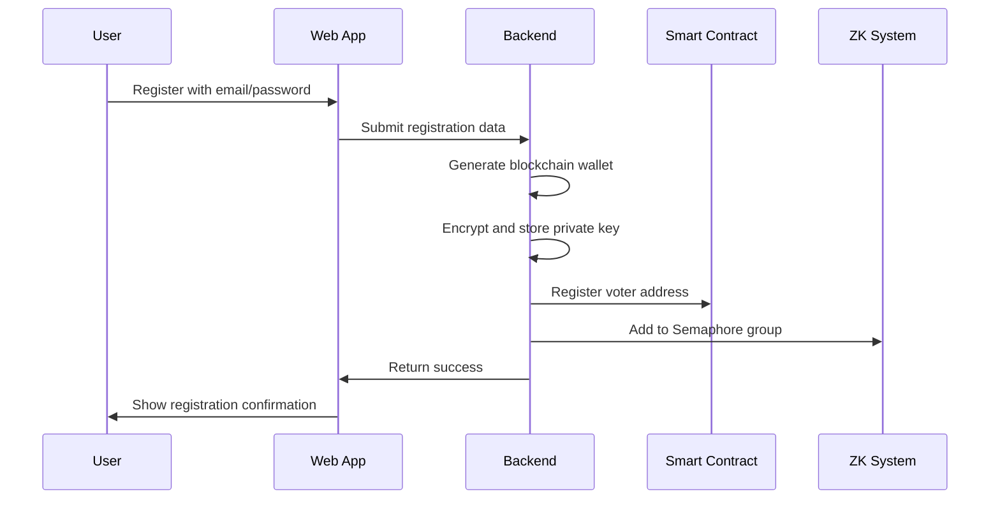
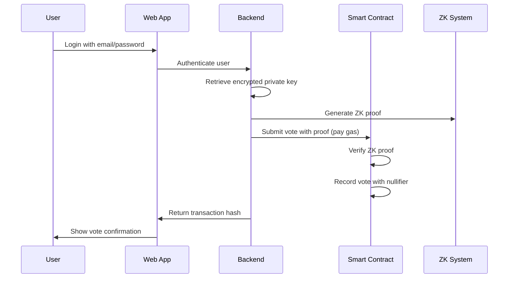

# ZK + Gasless Integration Plan

This document outlines the complete integration plan for combining Zero-Knowledge privacy with gasless transactions in the Blockchain Voting System.

## Overview

The integration combines:
1. **ZK Privacy**: Semaphore for anonymous voter eligibility verification
2. **Gasless UX**: Backend relayer for seamless user experience
3. **Blockchain Integrity**: Immutable vote recording on-chain

## Architecture

```
User Flow:
1. User → Web App (email/password)
2. Web App → Backend (authenticate)
3. Backend → Semaphore (generate ZK proof)
4. Backend → Blockchain (relay transaction, pay gas)
5. Blockchain → Results (public verification)

Privacy Benefits:
- Users never handle wallets
- No gas fees for users
- Vote privacy protected by ZK
- Immutable public records
```

## Implementation Phases

### Phase 1: Basic Blockchain Integration (Week 1)

#### 1.1 Wallet Management
- Generate blockchain wallets for each voter during registration
- Store encrypted private keys in database
- Map user accounts to blockchain addresses

#### 1.2 Election Management
- Create elections on blockchain
- Register parties and candidates on blockchain
- Sync election data between backend and blockchain

#### 1.3 Voting Submission
- Submit votes directly to blockchain contracts
- Verify vote success and handle errors
- Maintain consistency between backend and blockchain

### Phase 2: ZK Privacy Integration (Week 2)

#### 2.1 Semaphore Setup
- Integrate Semaphore libraries
- Create voter groups for each election
- Generate identity commitments for voters

#### 2.2 ZK Proof Generation
- Generate eligibility proofs during voting
- Verify proof validity before submission
- Handle proof generation errors gracefully

#### 2.3 Smart Contract Updates
- Deploy Semaphore verifier contracts
- Update voting contracts to accept ZK proofs
- Implement nullifier system for double-vote prevention

### Phase 3: Gasless Transaction Integration (Week 3)

#### 3.1 Backend Relayer
- Implement transaction signing service
- Create gas payment infrastructure
- Add transaction monitoring and logging

#### 3.2 Meta-Transaction Flow
- Update vote submission to use meta-transactions
- Add signature verification on smart contracts
- Implement replay protection

#### 3.3 User Experience
- Hide blockchain complexity from users
- Maintain familiar web app interface
- Provide clear transaction feedback

## Detailed Implementation

### Voter Registration Flow



### Voting Flow



## Technical Components

### 1. Voter Wallet Management

#### Backend Service
```typescript
class VoterWalletService {
  async createWalletForVoter(voterId: string): Promise<VoterWallet> {
    // Generate new Ethereum wallet
    const wallet = ethers.Wallet.createRandom()
    
    // Encrypt private key
    const encryptedPrivateKey = encrypt(wallet.privateKey, masterKey)
    
    // Store in database
    await database.storeEncryptedPrivateKey(voterId, encryptedPrivateKey)
    
    // Return wallet info
    return {
      address: wallet.address,
      publicKey: wallet.publicKey
    }
  }
  
  async getEncryptedPrivateKey(voterId: string): Promise<string> {
    return await database.getEncryptedPrivateKey(voterId)
  }
  
  async decryptPrivateKey(encryptedKey: string): Promise<string> {
    return decrypt(encryptedKey, masterKey)
  }
}
```

#### Database Schema
```sql
CREATE TABLE voters (
  id TEXT PRIMARY KEY,
  first_name TEXT NOT NULL,
  last_name TEXT NOT NULL,
  profile_photo TEXT,
  email TEXT UNIQUE NOT NULL,
  address TEXT NOT NULL,           -- Blockchain address
  private_key TEXT NOT NULL,       -- Encrypted private key
  created_at TEXT DEFAULT CURRENT_TIMESTAMP,
  updated_at TEXT
);
```

### 2. Semaphore Integration

#### Identity Management
```typescript
import { Identity } from '@semaphore-protocol/identity'
import { Group } from '@semaphore-protocol/group'

class SemaphoreService {
  private groups: Map<number, Group> = new Map()
  
  async createGroup(electionId: number): Promise<Group> {
    const group = new Group(20) // Depth 20
    this.groups.set(electionId, group)
    return group
  }
  
  async addVoterToGroup(
    electionId: number,
    identityCommitment: bigint
  ): Promise<void> {
    const group = this.groups.get(electionId)
    if (!group) {
      throw new Error(`Group not found for election ${electionId}`)
    }
    
    group.addMember(identityCommitment)
  }
  
  async generateProof(
    identity: Identity,
    groupId: bigint,
    signal: string,
    externalNullifier: string
  ) {
    return await generateProof(identity, groupId, signal, externalNullifier)
  }
}
```

#### Smart Contract Integration
```solidity
contract ZKVoting {
    ISemaphore public semaphore;
    uint256 public groupId;
    
    // Track nullifiers to prevent double voting
    mapping(uint256 => bool) public nullifierHashes;
    
    function castVoteWithZK(
        uint256 electionId,
        uint256 merkleTreeRoot,
        uint256 nullifierHash,
        uint256[8] calldata proof,
        bytes32 signal
    ) external {
        // Prevent double voting
        require(!nullifierHashes[nullifierHash], "Already voted");
        
        // Verify ZK proof (Semaphore verification)
        semaphore.verifyProof(
            groupId,
            merkleTreeRoot,
            signal,
            nullifierHash,
            groupId, // externalNullifier
            proof
        );
        
        // Mark as voted
        nullifierHashes[nullifierHash] = true;
        
        // Process the vote
        processVote(electionId, signal);
    }
}
```

### 3. Gasless Transaction Relayer

#### Backend Relayer
```typescript
class GaslessTransactionRelayer {
  private provider: ethers.providers.JsonRpcProvider
  private wallet: ethers.Wallet
  
  constructor(rpcUrl: string, privateKey: string) {
    this.provider = new ethers.providers.JsonRpcProvider(rpcUrl)
    this.wallet = new ethers.Wallet(privateKey, this.provider)
  }
  
  async executeGaslessVote(
    contractAddress: string,
    abi: any,
    electionId: number,
    voterAddress: string,
    signature: string
  ): Promise<string> {
    const contract = new ethers.Contract(contractAddress, abi, this.wallet)
    
    const tx = await contract.castVoteWithSignature(
      electionId,
      voterAddress,
      signature
    )
    
    const receipt = await tx.wait()
    return receipt.transactionHash
  }
}
```

#### Meta-Transaction Smart Contract
```solidity
contract GaslessVoting {
    address public admin;
    mapping(address => bool) public registeredVoters;
    mapping(bytes32 => bool) public executedTransactions;
    
    function castVoteWithSignature(
        uint256 electionId,
        address voter,
        bytes memory signature
    ) external {
        // Create transaction hash
        bytes32 transactionHash = keccak256(
            abi.encodePacked(electionId, voter, block.chainid)
        );
        
        // Prevent replay attacks
        require(!executedTransactions[transactionHash], "Transaction already executed");
        executedTransactions[transactionHash] = true;
        
        // Verify signature
        bytes32 ethSignedMessageHash = transactionHash.toEthSignedMessageHash();
        address signer = ethSignedMessageHash.recover(signature);
        require(signer == voter, "Invalid signature");
        require(registeredVoters[voter], "Voter not registered");
        
        // Process vote
        _processVote(electionId, voter);
    }
}
```

## Security Considerations

### 1. Private Key Management
- **Encryption**: Always encrypt private keys at rest
- **Key Derivation**: Use strong key derivation functions
- **Access Control**: Limit access to encryption keys
- **Rotation**: Implement key rotation mechanisms

### 2. ZK Proof Security
- **Validation**: Always validate ZK proofs before processing
- **Group Membership**: Verify voter belongs to correct group
- **Nullifiers**: Prevent double voting with unique nullifiers
- **External Nullifiers**: Use unique external nullifiers per election

### 3. Gasless Transaction Security
- **Signature Verification**: Verify all signatures match claimed addresses
- **Replay Protection**: Use transaction hashes to prevent replay attacks
- **Rate Limiting**: Implement rate limiting to prevent abuse
- **Access Control**: Restrict relayer access to authorized backend

## User Experience

### 1. Registration
- Email/password registration
- Automatic wallet creation
- No wallet installation required

### 2. Login
- Traditional authentication
- No blockchain interaction visible

### 3. Voting
- Simple ballot interface
- One-click vote submission
- Success confirmation without blockchain details

### 4. Results
- Public blockchain-verified results
- No voter identity linkage
- Transparent tallying process

## Performance Optimization

### 1. Caching
```typescript
// Cache frequently accessed data
const cache = new Map()
const CACHE_TTL = 5 * 60 * 1000 // 5 minutes

function getCachedValue(key: string) {
  const cached = cache.get(key)
  if (cached && Date.now() - cached.timestamp < CACHE_TTL) {
    return cached.value
  }
  return null
}
```

### 2. Batch Operations
```typescript
// Batch multiple votes in single transaction
async function batchVoteSubmission(votes: VoteData[]) {
  // Submit all votes in one blockchain transaction
  // Reduces gas costs and improves performance
}
```

### 3. Background Processing
```typescript
// Generate ZK proofs in background
const worker = new Worker('/zk-proof-worker.js')

worker.postMessage({
  action: 'generateProof',
  data: { identity, groupId, signal, externalNullifier }
})

worker.onmessage = (event) => {
  const { proof } = event.data
  // Handle generated proof
}
```

## Monitoring and Analytics

### 1. Transaction Tracking
```typescript
class TransactionMonitor {
  async logTransaction(
    txHash: string,
    userId: string,
    action: string,
    status: 'submitted' | 'confirmed' | 'failed'
  ) {
    await database.logTransaction({
      txHash,
      userId,
      action,
      status,
      timestamp: new Date()
    })
  }
}
```

### 2. Performance Metrics
```typescript
class PerformanceMonitor {
  async measureProofGeneration(duration: number) {
    // Track ZK proof generation times
    await analytics.track('zk_proof_generation_time', {
      duration_ms: duration,
      timestamp: new Date()
    })
  }
  
  async measureTransactionRelay(duration: number) {
    // Track gasless transaction relay times
    await analytics.track('gasless_transaction_relay_time', {
      duration_ms: duration,
      timestamp: new Date()
    })
  }
}
```

## Testing Strategy

### 1. Unit Tests
```typescript
describe('ZK + Gasless Integration', () => {
  it('should generate valid ZK proof', async () => {
    const identity = new Identity()
    const group = new Group(20)
    group.addMember(identity.commitment)
    
    const proof = await generateProof(
      identity,
      group,
      'test_signal',
      'test_external_nullifier'
    )
    
    expect(proof).toBeDefined()
    expect(proof.proof).toBeDefined()
  })
  
  it('should execute gasless transaction', async () => {
    const relayer = new GaslessTransactionRelayer(rpcUrl, privateKey)
    const txHash = await relayer.executeGaslessVote(
      contractAddress,
      abi,
      electionId,
      voterAddress,
      signature
    )
    
    expect(txHash).toBeDefined()
    expect(ethers.utils.isHexString(txHash)).toBe(true)
  })
})
```

### 2. Integration Tests
```typescript
describe('End-to-End Voting Flow', () => {
  it('should complete anonymous voting with gasless transaction', async () => {
    // 1. Register voter with ZK identity
    const voter = await registerVoter()
    
    // 2. Generate ZK proof
    const proof = await generateZKProof(voter.identity)
    
    // 3. Submit vote via gasless transaction
    const txHash = await submitGaslessVote(proof)
    
    // 4. Verify vote was recorded
    const voteExists = await checkVoteExists(voter.address)
    expect(voteExists).toBe(true)
    
    // 5. Verify voter cannot vote again
    const hasVoted = await checkHasVoted(voter.address)
    expect(hasVoted).toBe(true)
  })
})
```

## Deployment Considerations

### 1. Environment Variables
```env
# Blockchain Configuration
BLOCKCHAIN_RPC_URL=https://polygon-rpc.com
BLOCKCHAIN_VOTING_SYSTEM_ADDRESS=0x...
BLOCKCHAIN_WALLET_PRIVATE_KEY=0x...

# Encryption
ENCRYPTION_KEY=supersecretkey

# ZK Configuration
SEMAPHORE_GROUP_DEPTH=20
```

### 2. Infrastructure
- **Relayer Wallet**: Funded wallet for gas payments
- **Monitoring**: Transaction tracking and alerting
- **Scaling**: Load balancing for proof generation
- **Backup**: Disaster recovery for voter keys

## Future Enhancements

### 1. Advanced ZK Features
- Quadratic voting with ZK
- Range proofs for vote weights
- Multi-election identity management

### 2. Improved UX
- Mobile-friendly identity management
- Social recovery for identities
- Progressive disclosure of proofs

### 3. Enhanced Security
- Multi-signature identity schemes
- Threshold cryptography integration
- Quantum-resistant algorithms

This integration plan provides a roadmap for implementing ZK privacy with gasless transactions while maintaining a familiar web application experience for voters.